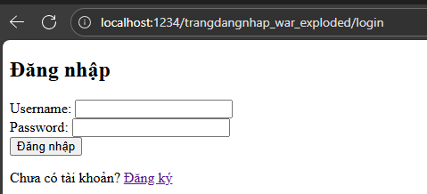
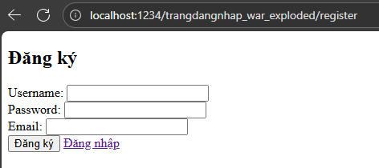
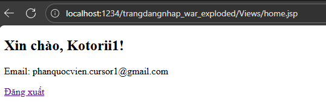

# Ứng dụng đăng nhập/đăng ký (Servlet + JSP + JDBC)

Ứng dụng mẫu nhiều tầng (DAO/Service/Controller) kết nối SQL Server, hỗ trợ đăng ký/đăng nhập. Mật khẩu được băm SHA-256 trước khi lưu DB. Đã refactor JSP sang JSTL (URI Jakarta EE 10), bổ sung Remember Me (Cookie), và mở rộng `User` với `roleId`.

## Ảnh giao diện

### Đăng nhập


### Đăng ký


### Trang chủ


## Yêu cầu
- JDK 17+ (khuyên dùng JDK 21+). Cần thiết lập `JAVA_HOME` khi build.
- Maven 3.9+ hoặc dùng Maven Wrapper (`mvnw.cmd`).
- SQL Server 2019+
- Máy chủ servlet hỗ trợ Jakarta EE 10 (Tomcat 10.1+) hoặc chạy trực tiếp từ IDE

## Cấu trúc chính
- Model: `org.example.trangdangnhap.model.User`
- DAO: `org.example.trangdangnhap.dao.UserDAO`, `dao.impl.UserDAOImpl`
- Service: `org.example.trangdangnhap.service.UserService`, `service.impl.UserServiceImpl`
- Controller: `org.example.trangdangnhap.UserController`
- JSP: `src/main/webapp/Views/login.jsp`, `Views/register.jsp`, `Views/home.jsp`

## Cấu hình DB
Sửa `src/main/java/org/example/trangdangnhap/util/DBConnection.java`:
```java
private static final String JDBC_URL = "jdbc:sqlserver://localhost:1433;databaseName=DBUser;encrypt=false";
private static final String JDBC_USER = "sa";
private static final String JDBC_PASSWORD = "<your_password>";
```
Driver đã khai báo trong `pom.xml` (`com.microsoft.sqlserver:mssql-jdbc`).

## Tạo database và bảng `User`
```sql
-- 1) Tạo database
IF DB_ID('DBUser') IS NULL
BEGIN
    CREATE DATABASE DBUser;
END
GO

USE DBUser;
GO

-- 2) Tạo bảng [User]
IF OBJECT_ID('[dbo].[User]', 'U') IS NOT NULL
BEGIN
    DROP TABLE [dbo].[User];
END
GO

CREATE TABLE [dbo].[User] (
    [id]        BIGINT IDENTITY(1,1) PRIMARY KEY,
    [username]  VARCHAR(50)  NOT NULL,
    [password]  VARCHAR(64)  NOT NULL,   -- SHA-256 hex dài 64 ký tự
    [email]     VARCHAR(255) NOT NULL,
    [roleId]    INT          NULL,       -- 1=admin, 2=manager, 3=user
    [createdAt] DATETIME     NOT NULL CONSTRAINT DF_User_createdAt DEFAULT (GETDATE())
);

-- 3) Ràng buộc/Index
CREATE UNIQUE INDEX UX_User_username ON [dbo].[User]([username]);
CREATE UNIQUE INDEX UX_User_email    ON [dbo].[User]([email]);

-- 4) Seed dữ liệu mẫu (mật khẩu đã băm SHA-256)
-- SHA-256('admin123') = 240be518fabd2724ddb6f04eeb1da5967448d7e831c08c8fa822809f74c720a9
INSERT INTO [dbo].[User] ([username], [password], [email], [roleId])
VALUES ('admin', '240be518fabd2724ddb6f04eeb1da5967448d7e831c08c8fa822809f74c720a9', 'admin@example.com', 1);
```

## Build và chạy
Windows (Maven Wrapper):
```powershell
./mvnw.cmd -DskipTests package
```
Nếu thiếu Java: cài JDK 17+ và thiết lập `JAVA_HOME` rồi chạy lại. Triển khai WAR lên Tomcat 10.1+ hoặc chạy từ IDE. `web.xml` cấu hình welcome đến `/login`.

## Luồng sử dụng
- Đăng ký: `POST /register` (form tại `Views/register.jsp`).
- Đăng nhập: `POST /login` (form tại `Views/login.jsp`) với tuỳ chọn "Ghi nhớ đăng nhập" (Cookie `remember_username`).
- Thành công chuyển đến `GET /home` (forward `Views/home.jsp`).
- Đăng xuất: `GET /logout` (huỷ session và xoá cookie Remember Me).

JSP dùng JSTL với URI mới Jakarta EE 10:
```jsp
<%@ taglib prefix="c" uri="jakarta.tags.core" %>
```


## Kiểm thử nhanh và xử lý sự cố
- Đăng ký tài khoản mới rồi đăng nhập ngay sau đó.
- Nếu đăng nhập thất bại sau khi đăng ký:
  - Kiểm tra độ dài cột `password` phải là 64 ký tự (SHA-256 hex). Nếu ngắn hơn, chạy:
    ```sql
    ALTER TABLE [dbo].[User] ALTER COLUMN [password] VARCHAR(64) NOT NULL;
    ```
  - Đảm bảo `DBConnection` trỏ đúng `DBUser` và thông tin đăng nhập SQL Server chính xác.
  - Thử xoá cookie `remember_username` hoặc truy cập `/logout` rồi đăng nhập lại.

## Ghi chú bảo mật
- Demo dùng SHA-256 không có salt. Sản xuất nên dùng bcrypt/argon2 và HTTPS.
- Remember Me minh hoạ lưu `username` dạng cookie. Thực tế nên dùng token ký HMAC và có hạn sử dụng ngắn.


